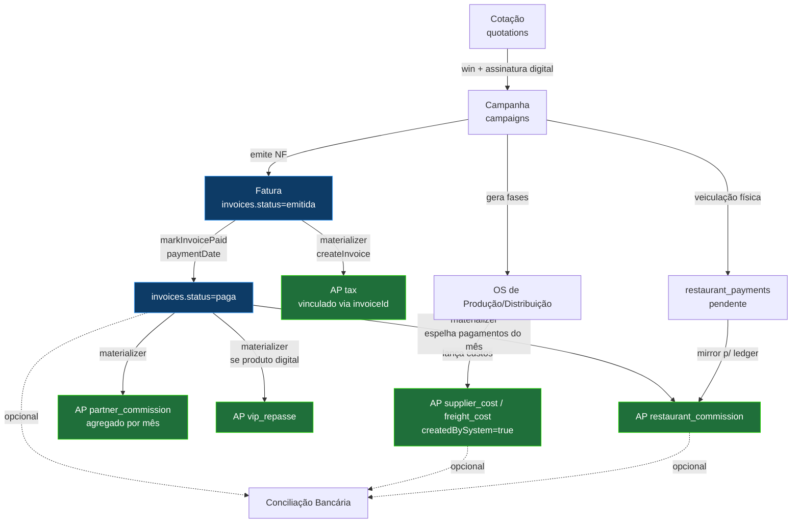
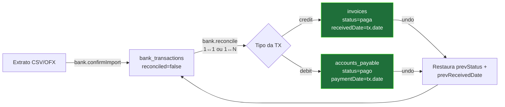
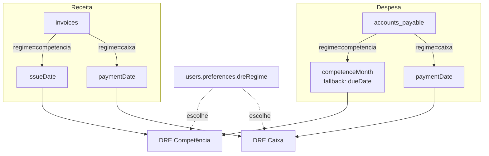
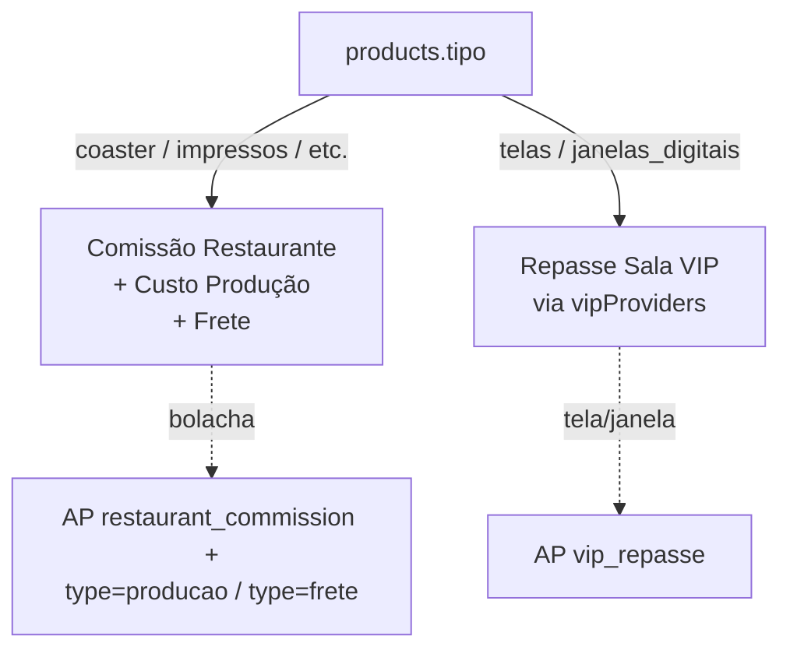

# Fluxograma Financeiro — mesa.ads

Diagrama de referência do ciclo financeiro completo após a refatoração
(finrefac #1–#10). Para definição de cada termo, consulte
[`financeiro-glossario.md`](./financeiro-glossario.md).

---

## 1. Ciclo principal — Cotação → Recebimento



**Pontos-chave:**
- `accounts_payable` é o **ledger único**. Toda saída (humana ou automática)
  vive aqui com `sourceType` semântico.
- `createInvoice` tem garantia causal: ao menos 1 AP `tax` com `invoiceId` é
  criada. A spec `e2e/finance-invoice-lifecycle.spec.ts` valida.
- `markInvoicePaid` dispara dois materializadores idempotentes
  (`partner_commission`, `vip_repasse`) sob advisory lock por
  `(partnerId, competenceMonth)` para evitar lost-update.

---

## 2. Conciliação Bancária



**Regras:**
- `credit` só concilia `invoice`; `debit` só concilia `accounts_payable`.
- Soma dos `matches` precisa bater com o valor da transação (tolerância R$ 0,01).
- `bank.undoReconcile` lê `prevStatus`, `prevReceivedDate`, `prevPaymentDate`
  salvos em cada match e restaura o estado anterior à conciliação.

---

## 3. DRE Dual (Competência vs Caixa)



A escolha do regime persiste por usuário e propaga para todos os cards do
dashboard (DSO, aging 0-30/30-60/60-90/90+, funil, exportações CSV/PDF).

---

## 4. Auditoria

```mermaid
flowchart LR
  ACT[Mutação financeira<br/>create/update/mark_paid/<br/>revert_payment/reconcile] -->|wrapper audited()| AUD[audit_log]
  AUD -->|antes/depois + diff| UI[financial.listAuditLog]
```

Cobertura atual: `invoice`, `accounts_payable`, `restaurant_payment`,
`bank_transaction`. Diff é calculado pelo wrapper `audited()` em
`server/_finance/audit.ts` comparando `loadBefore` vs estado pós-mutação.

---

## 5. "Tela vs Bolacha" — bifurcação no materializador



> Detecção em runtime: `isDigitalProduct()` em `server/finance/calc.ts`.

A regra é a única bifurcação no fluxo de materialização: produtos digitais
**pulam** comissão restaurante, custo de produção e frete; em vez disso,
geram repasse para o `vipProvider` vinculado.

---

_Última atualização: refatoração financeira #1–#10 concluída._
